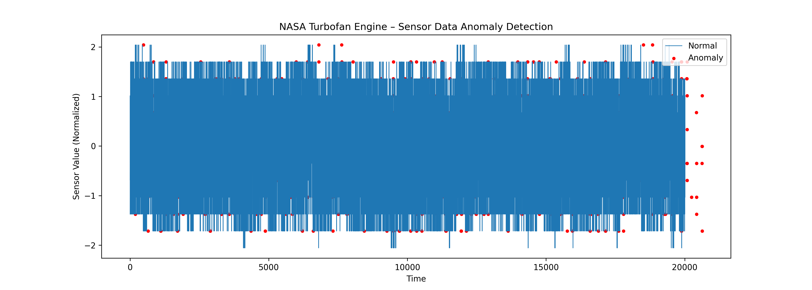

# 🔍 AI-Based Anomaly Detection on NASA Turbofan Engine Sensor Data (CMAPSS)

## 📌 Overview

This project detects abnormal behavior in real turbofan aircraft engine telemetry using a hybrid ML + DL approach:

**Isolation Forest** — unsupervised anomaly detection

**Autoencoder Neural Network** — reconstruction-based anomaly detection

The dataset used is **NASA CMAPSS FD001**, containing turbofan engine sensor readings collected across multiple operational cycles until failure.

This methodology supports aviation safety, defence telemetry, fault diagnosis, and predictive maintenance.

## 📂 Project Structure

anomaly_detection/
│
├── dataset/
│   └── train_FD001.txt
│
├── src/
│   ├── preprocessing.py
│   ├── anomaly_detection.py
│   └── visualize.py
│
├── results/
│   ├── anomaly_plot.png
│   └── anomaly_log.txt
│
├── requirements.txt
└── README.md

## 🛠️ Technologies Used

Python

Pandas, NumPy

Scikit-learn — Isolation Forest

TensorFlow / Keras — Autoencoder

Matplotlib — visualization

## 🚀 How It Works
### ✅ 1. Load & Clean Data

Read CMAPSS FD001 dataset

Remove empty/unnecessary columns

Normalize sensor values

### ✅ 2. Train Isolation Forest

Detects anomalies based on:

spikes

distribution shifts

unusual operational behavior

### ✅ 3. Train Autoencoder

Learns normal sensor behavior

High reconstruction error → anomaly

### ✅ 4. Hybrid Decision Logic
If Isolation Forest OR Autoencoder flags → anomaly = 1

### ✅ 5. Output

anomaly_plot.png — visual anomaly timeline

anomaly_log.txt — anomaly records with sensor values

## ▶️ Running the Project

Install dependencies:

pip install -r requirements.txt

Run detection:

python src/anomaly_detection.py

## 📈 Sample Output

Plot showing detected anomalies (red) vs normal readings

Log file listing anomaly points with timestamps

## 🎯 Why This Project is Relevant to DRDO

Uses real aviation-grade sensor telemetry

Demonstrates predictive maintenance capability

Combines ML + Deep Learning for fault detection

Applicable to aircraft engines, UAV propulsion, missile systems

Reflects real analytical workflows used in defence research labs

## 📚 Future Enhancements

LSTM-based temporal anomaly detection

Multi-sensor anomaly scoring

Real-time streaming detection pipeline

Explainability using SHAP / feature attribution

## 👤 Author

Sravani Teeda
CSE (AI & ML), 2026
Open to Research & Defence Internships